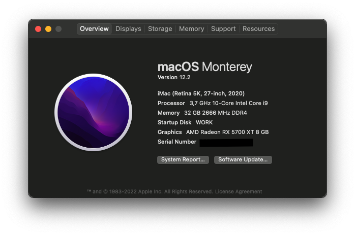

# Hackintosh

Installation details for my Hackintosh v3 build dual-booting macOS Monterey, Ubuntu Linux 20.04 and Windows 11.
This build is based on [Dortania's OpenCore Install Guide](https://dortania.github.io/OpenCore-Install-Guide/). The version numbers reported in this guide were the releases available at the time of installation and more than likely can be replaced with the latest iteration.

* [EFI](EFI/): Copy of current EFI directory from macOS boot drive

**Latest working macOS**: 12.3 Monterey
 
**Current OpenCore**: 0.7.7

## Table of Contents

* [Build](#build)
* [Kext](#kexts)
* [Working](#working)
* [Credits](#credits)

## Build

* **CPU:** Intel Core i9-10900KF 3.7 GHz (no IGPU)
* **CPU Cooler:** Cooler Master Hyper TX3
* **Motherboard:** Gigabyte Z490M Gaming X
* **Memory:** 32 GB DDR4-2600
* **Storage (macOS):** Samsung 970 Evo 250 TB
* **Storage (Linux):** Samsung 970 Evo 120 TB
* **Storage (Windows):** Samsung 970 Evo 120 TB
* **Video Card:** Gigabyte Radeon RX 5700 XT 8 GB
* **Keyboard:** Logitech G420 SILVER
* **Mouse:** Logitech G305 Wireless

## Kexts:
- AppleALC.kext
- IntelMausi.kext
- Lilu.kext
- SMCProcessor.kext
- SMCSuperIO.kext
- USBMap.kext
- VirtualSMC.kext
- WhateverGreen.kext

## Working
- Big Sur, Catalina, Monterey
- Audio
- HDMI/DP
- All USB ports
- Drive, iMessage, Facetime, unlock with Apple Watch
- Temperature monitoring
- Shutdown/Reboot/Update to newer macOS builds over time

## Credits
- [Opencore Team](https://dortania.github.io/getting-started/)
